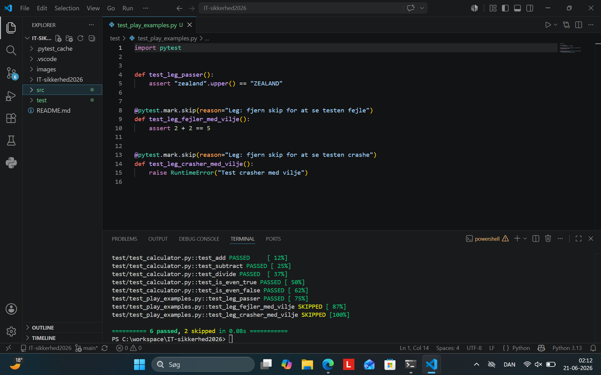
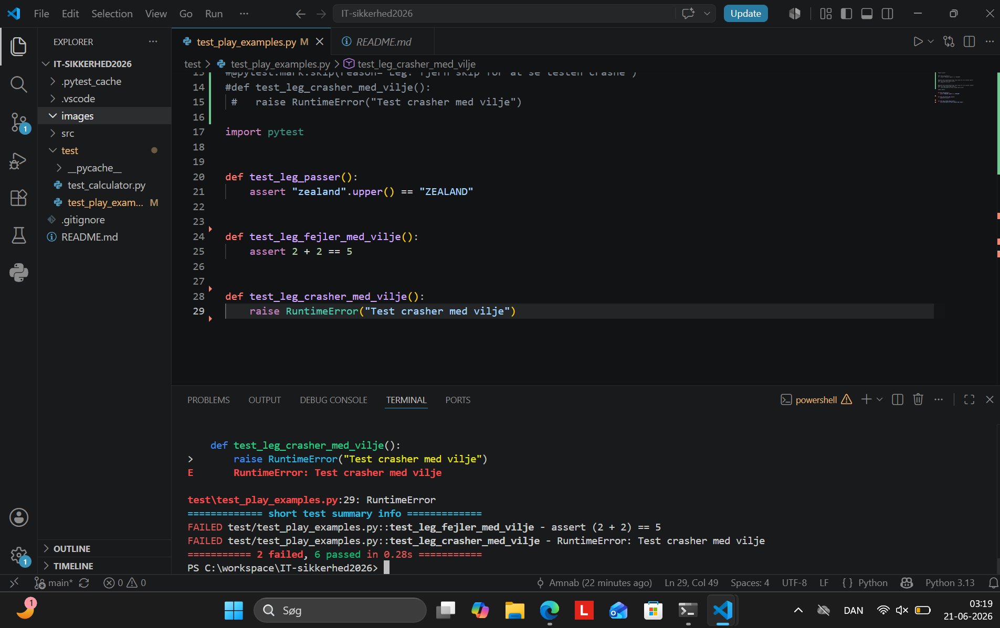

# IT-sikkerhed2026

Dette er et skoleprojekt på Zealand Køge.

## Screenshot af unit-tests

Dette screenshot viser den endelige testkørsel, hvor unit-testene kører korrekt. Resultatet er `6 passed, 2 skipped`.

## Screenshot af leg med tests

Dette screenshot viser leg-opgaven, hvor jeg midlertidigt fjernede `@pytest.mark.skip` fra to tests. Resultatet er `2 failed, 6 passed`.

Den ene test fejler, fordi den indeholder en forkert assertion: `2 + 2 == 5`. Den anden test crasher, fordi den udløser en `RuntimeError`. Det viser, hvordan pytest håndterer både almindelige testfejl og runtime-fejl.

